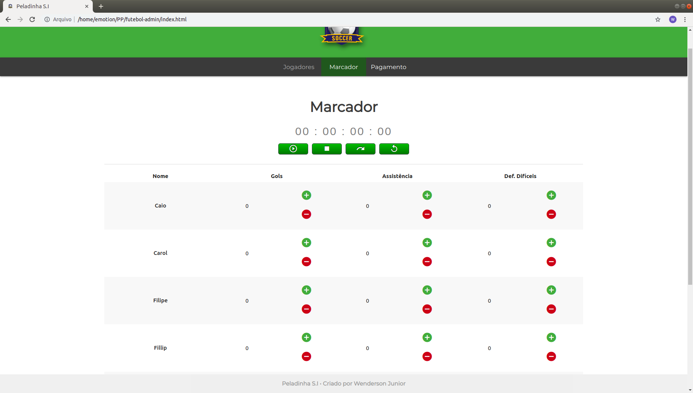
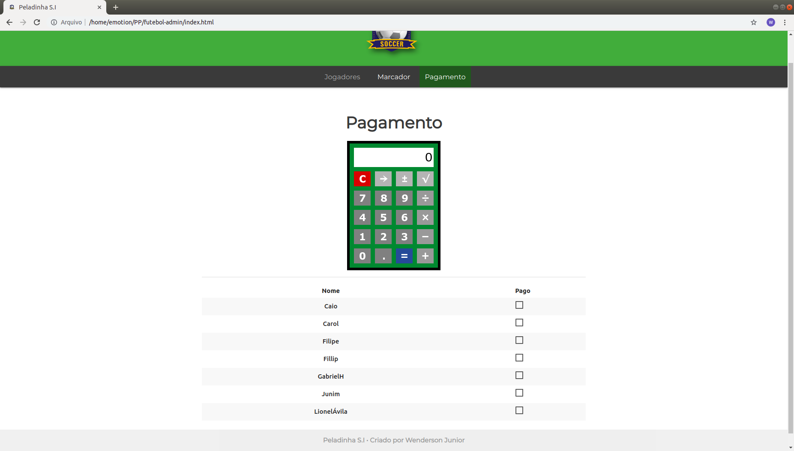

# Futebol-admin

Aplicação desenvolvida para gerenciar saldo de gols, assistências, defesas, pagamento e o tempo das partidas de futebol. Projetado, desenhado e desenvolvido por[Wenderson Jr.](https://github.com/wendej).

Esta aplicação é SPA (Single Page Application).






## Conteudo

- [Estrutura de Pastas](#estrutura-de-pastas)

## Estrutura de Pastas

```
./
├── index.html
├── README.md
|
├── css/                                
|   ├── materialize.css
|   └── style.css
|
├── js/                                
|   |── materialize.js
|   |── init.js
|   |── forms.js
|   |── jogadores.js
|   |── marcador.js
|   |── pagamento.js
│   └── scripts.js
|
└── img/                                
    |── logo.png
    └── screenshot/
        |── screen-1.png
        |── screen-2.png
        └── screen-3.png


```
